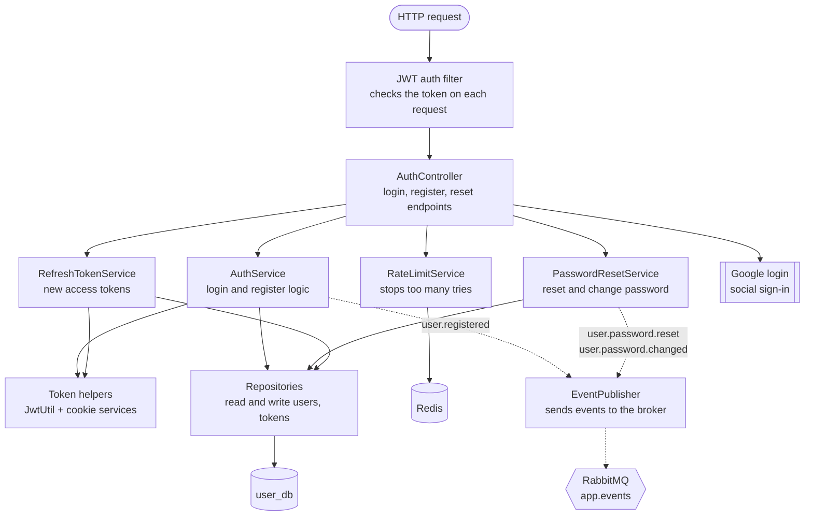

# user-service

```mermaid
flowchart TB
    req([HTTP request]) --> filter["JWT auth filter<br/>checks the token on each request"]
    filter --> ctrl["AuthController<br/>login, register, reset endpoints"]

    ctrl --> ratelimit["RateLimitService<br/>stops too many tries"]
    ctrl --> auth["AuthService<br/>login and register logic"]
    ctrl --> reset["PasswordResetService<br/>reset and change password"]
    ctrl --> refresh["RefreshTokenService<br/>new access tokens"]

    auth --> tokens["Token helpers<br/>JwtUtil + cookie services"]
    refresh --> tokens

    auth --> repo["Repositories<br/>read and write users, tokens"]
    reset --> repo
    refresh --> repo

    ratelimit --> redis[("Redis")]
    repo --> db[("user_db")]

    ctrl --> google[["Google login<br/>social sign-in"]]

    %% ---- events out: replaces the old EmailService ----
    auth -.->|"user.registered"| pub["EventPublisher<br/>sends events to the broker"]
    reset -.->|"user.password.reset<br/>user.password.changed"| pub
    pub -.-> broker{{"RabbitMQ<br/>app.events"}}
```